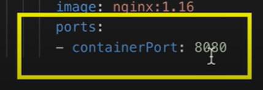

## Config file
- Each config file has 3 parts.
    - metadata
    - specification
        - It depends on "kind" of config file.
        - kind:deployment
        - kind:service
    - status 
        - automatically generated and updated by kubernetes.
        - kubernetes compares status with specs written in config file.
        - if not same then another replica is created and load is balanced.
        - this is called self healing feature of k8s.
        - From where does k8s gets the status data?
            - From etcd
            - it holds current status of any k8s component.

```yaml
apiVersion: apps/v1
kind: Deployment
metadata: 
  name: deployment-name
  labels:
    app: app-name

spec:
  replicas: 2
  selector: # Used is create connection/communication 
  # For Deployment
    matchLabels:
      app: app-name
  # For Service
    app: app-name
  template:     # It is config for Pod. has it's own metadata and spec section. Blueprint of Pos
    metadata:
      app: app-name
    spec:
      containers:
      - name: docker-image-name
        image: image-name:tag
        ports:
        - containerPort: portNum # Port binding of the container.
        # Used by service to forward requests from other service.

```
---

## Connecting Components
- Connection is made using Labels, selectors and ports.
- Metadata has labels.
- Specs has selectors.
- In metadata we have key-value pair of component. ( here we have app: name, it can be any).
- Pods get label through template blueprint.
- The label is matched by selector, to create connection.
- Label in deployment is used by "service" selector, to create connection between deployment and service so service can connect with pods.




---
## Checking IP Address of the pods
- For this we can get information of the service using `kubectl describe service <service-name>`
- This command would print information like, service name, namespace, labels, type, IP, targetPort, Endpoints(i.e. IP of Pods)
- To check IP of pods use `kubectl get pods -o wide` command which uses `-o` (output) flag with value "**wide**"
---

## The Thrid Part: Status
- As discussed above status will be injected by k8s so to read it we will write out our active deployment into a yaml file using `kubectl get deployment <deployment-name> -o yaml > depl-with-status.yaml`
