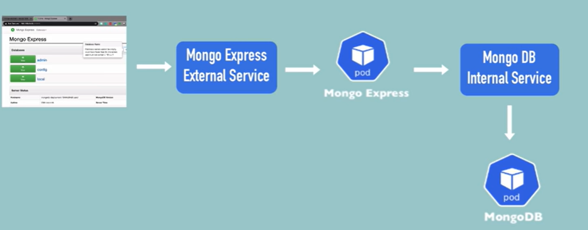
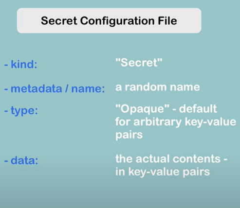

## Structure of Project



## Secret Config File


- In secret file, in data we write data in base64 format and not plain text.
- It is not by default.
- To generate base64 data
- In Linux shell 
```bash
echo -n 'Your Text' | base64
```


## To use/reference secret in config file
- First run secret file i.e.
    - kubectl apply -f secret-config.yaml
    ```yaml
    apiVersion: v1
    kind: Secret
    metadata:
    name: mongodb-secret
    type: Opaque
    data:
    mongo-root-username: dXNlcm5hbWU=
    password: cGFzc3dvcmQ=
    ```
- In file where it is to be referred,
    ```yaml
    env:
      - name: MONGO_INITDB_ROOT_USERNAME
          valueFrom: 
            secretKeyRef:
              name: mongodb-secret
              key: mongo-root-username
      - name: MONGO_INITDB_ROOT_PASSWORD
          valueFrom: 
            secretKeyRef:
              name: mongodb-secret
              key: password
    ```
