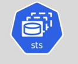
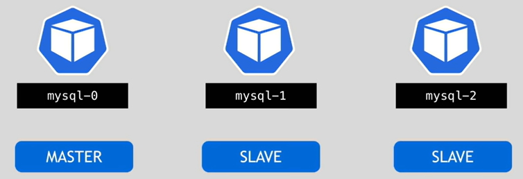

## What are StatefulSets?
- It is a Kubernetes component, used to deploy stateful app.

## Stateful App
- Any app that stores data to keep track of it's state.
- Eg: All kind of DBs.



## Stateless App
- Don't keep record of state.
- each request is completely new, and process data that comes with it.
- It may connect with stateful apps to forward request to it.
- Eg: Our Backend app is stateless app, it connects with DB (Stateful app) for CRUD.


---

- Stateless apps are deployed using deployment
- Stateful apps are deployed using StatefulSet

---

## Deployment V/S StatefulSet
* Deployment
    - Easily Scalable
    - Pods are Identical and Interchangeable
    - Created in random order with random hashes
    - One service that load balances to any pod.


* StatefulSet
    - Can't be created/deleted at same time.
    - Can't be randomly addressed
    - Replica Pods are not identical
        - Maintains Pod Identity
        - Sticky identity for each pod
        - Not interchangeable, as persistent identifier across any re-scheduling.

## Why Pods in SS need identity?
- Suppose Database is scaled, then not all pods are allowed to ``` Write ```.
- Only one shared Pod is allowed to write, it is called ```MASTER POD```.
- and rest all pods are called ```WORKER POD```, they are allowed only to read.

- THIS PODS DO NOT USE SAME PHYSICAL STORAGE.
    - So to maintain data consistency, they need to synchronize with each other.

- So now, when new pod is added to cluster, it clones data from PREVIOUS POD.

- Each Pod has ``` POD STATE ``` i.e. it knows whether it is master or worker pod and has stores/maintains data of it's own.
    - Now when that pod dies and replaced by another pod, ```IDENTITY``` helps to bind data left by dead pod to replaced pod.
    - And so storage should be ```REMOTE```

- Pod Identity
    - SS pods gets fixed ordered names.
    - ```$(statefulset name)-$(ordinal/number)```


- Next Pod is only created if previous is UP and RUNNING.

- Deletion is done in reverse order.

- Each Pod has 2 Endpoints
    - Each Pod gets it's own DNS endpoint from service.
    - Each Pod has individual service name.
        - ```$(pod name).$(governing service domain) ```
- When Pod Restarts:
    - IP Changes
    - Name and endpoint stays same
        - So this sticky identity helps to retain state and role

---

## Replicating stateful apps
- Complex
- Need to configure
    - Cloning and Synchronization
    - Make Remote storage available
    - Manage back-up

# Stateful apps are not perfect for containerization