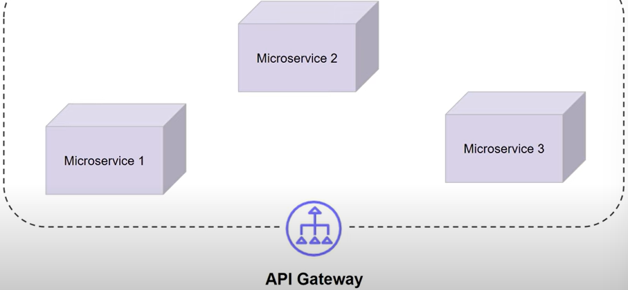

# API Gateway
- As in the microservice application, every microservice runs on different endpoint, so there is not fix endpoint to our application.
- So we use API gateway for this purpose.
- It provides single endpoint to our application, and takes care of forwarding request to respective microservice.
- It is a reverse proxy.


### Responsibility of API Gateway
- Request Routing
- Load Balancing
- Authentication and Authorization
- Rate Limiting
- Pre-processing of request and Post-processing of Response
- Aggregation of data from multiple services

## Advantages of API Gateway.
- It encapsulates the internal system architecture
- Handle cross-cutting concerns like security, load balancing, rate limiting, and analytics.
- Can authenticate incoming requests and pass only valid requests to the services.
- Can aggregate responses from different microservices.
- Plays a crucial role in simplifying client interactions and managing cross-cutting concerns.

## High Level Design of App With API Gateway.


---

# Configuring API Gateway.
- Create a new project with ```Gateway, Zipkin, Eureka Client``` As Dependency.
```xml
<dependencies>
        <dependency>
            <groupId>org.springframework.boot</groupId>
            <artifactId>spring-boot-starter-actuator</artifactId>
        </dependency>
        <dependency>
            <groupId>io.micrometer</groupId>
            <artifactId>micrometer-tracing-bridge-brave</artifactId>
        </dependency>
        <dependency>
            <groupId>io.zipkin.reporter2</groupId>
            <artifactId>zipkin-reporter-brave</artifactId>
        </dependency>
        <dependency>
            <groupId>org.springframework.cloud</groupId>
            <artifactId>spring-cloud-starter-gateway-mvc</artifactId>
        </dependency>
        <dependency>
            <groupId>org.springframework.cloud</groupId>
            <artifactId>spring-cloud-starter-netflix-eureka-client</artifactId>
        </dependency>
    </dependencies>
    <dependencyManagement>
        <dependencies>
            <dependency>
                <groupId>org.springframework.cloud</groupId>
                <artifactId>spring-cloud-dependencies</artifactId>
                <version>${spring-cloud.version}</version>
                <type>pom</type>
                <scope>import</scope>
            </dependency>
        </dependencies>
    </dependencyManagement>

```
- Now Configure Routes in **application.properties** file of this project
```properties
spring.application.name=APIGateway
server.port=8084


# Actuator
## Below property is added so that we can access all the endpoint provided by actuator.
management.endpoints.web.exposure.include=*
management.endpoint.health.show-details=always
management.info.env.enabled=true
info.app.name=API Gateway
info.app.description=AppByNisarg
management.endpoint.shutdown.enabled=true

# Eureka
eureka.client.register-with-eureka=true
eureka.client.fetch-registry=true
eureka.client.serviceUrl.defaultZone=http://localhost:8761/eureka/

# Zipkin
management.tracing.sampling.probability=1.0


# Gateway Routing Logic
spring.cloud.gateway.mvc.routes[0].id=company_service
spring.cloud.gateway.mvc.routes[0].uri=http://localhost:8081
spring.cloud.gateway.mvc.routes[0].predicates[0]=Path=/companies/**

spring.cloud.gateway.mvc.routes[1].id=job_service
spring.cloud.gateway.mvc.routes[1].uri=http://localhost:8082
spring.cloud.gateway.mvc.routes[1].predicates[0]=Path=/jobs/**

spring.cloud.gateway.mvc.routes[2].id=review_service
spring.cloud.gateway.mvc.routes[2].uri=http://localhost:8083
spring.cloud.gateway.mvc.routes[2].predicates[0]=Path=/reviews/**

# Logging
logging.level.root=info
logging.level.org.springframework.cloud.gateway.server=INFO
logging.level.org.springframework.cloud.gateway=TRACE
```
- Now simply go to browser and visit ```localhost:8084/any_vaild_endpoint_like_Job_or_company_or_review```, it will automatically be redirected to respective Service.

- But in above, we have hardcoded the urls with IP (i.e. localhost) and port number.
- And this may create problem when there are multiple instance running as we need to create route for each of them, plus this won't be load balanced.
- So for this we use **```lb```** instead of **```http```**, and service name instead of IP and Port.
- So instead of config of company service as above, we would change it to the below config:
```properties
spring.cloud.gateway.mvc.routes[0].uri=lb://CompanyMS
```
- Now it is load balanced and we can create multiple instances, with only one mapping for the service.

---

## Accessing Eureka, from API Gateway
- We can do that by adding below routes to API Gateway application.properties file
```properties
spring.cloud.gateway.mvc.routes[3].id=eureka-server
spring.cloud.gateway.mvc.routes[3].uri=http://localhost:8761
spring.cloud.gateway.mvc.routes[3].predicates[0]=Path=/eureka/main
spring.cloud.gateway.mvc.routes[3].filters[0]=SetPath=/
# The above is added, because we want to redirect the request for eureka server
# to localhost:8761/  and not to localhost:8761/eureka/main which is mentioned in predicates
# But only by adding above piece of code, it will load single file and not css and other files.
# so for that we will write one more route.
spring.cloud.gateway.mvc.routes[4].id=eureka-server-static
spring.cloud.gateway.mvc.routes[4].uri=http://localhost:8761
spring.cloud.gateway.mvc.routes[4].predicates[0]=Path=/eureka/**
```