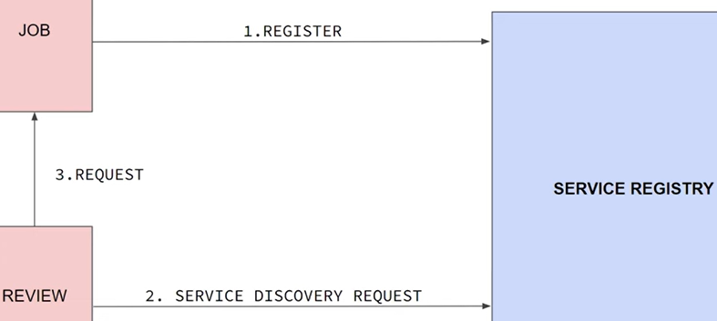

# ServiceRegistry
- It is used in microservice architecture to enable dynamic service discovery.
- Every microservice register itself with service registry and it enable us to discover microservice dynamically.
- If one service wants to communicate with other, then it needs to go to Service Registry to get the location of desired service and then communication begins.
- And when a M.S. shutdowns, Service Registry Automatically de-registers it.


- List of service registries:
    - Consul(Distributed)
    - Apache ZooKeeper(Centralized)
    - Etcd(Distributed)
    - Eureka(Centralized)
<br/>

---
# Why using service registry is beneficial?
- Dynamic Service discovery (No HardCoded URLs)
    - If using hardcoded url, so when service is relocated, then it's IP will change, URL will change, so we need to make changes everywhere, where we have used hardcoded urls.
- Load Balancing
    - Service registry can help in Load Balancer by distributing incoming traffic to multiple instances of a single service.
- Fault Tolerance and resilience
    - If a service fails, and other services are not aware that a service has failed, and when trying to communicate with it, there will be **ERRORS** everywhere.
    - But when using Service Registry it will make sure to mark the failed services so that other active service are aware of it, so that this active service can transfer their request to healthy instances of that service.
- Scalability and Elasticity
    - Service Registry provides centralized mechanism to manage service endpoints, so it is easy to scale up or down.
- Service Monitoring and Health checks

---
# Spring Cloud Eureka
- It is a service registry.
- It has two parts:
    - Server: registers service.
    - Client: discovers service.
```xml
<!-- Server dependency -->
   <dependency>
            <groupId>org.springframework.cloud</groupId>
            <artifactId>spring-cloud-starter-netflix-eureka-server</artifactId>
    </dependency>

<!-- Client Dependency -->

<!-- Add this in properties, at starting of the file -->
<spring-cloud.version>2023.0.1</spring-cloud.version>

<dependency>
			<groupId>org.springframework.cloud</groupId>
			<artifactId>spring-cloud-starter-netflix-eureka-client</artifactId>
			<version>4.1.1</version>
</dependency>
<!-- Add this before Build tag, and after dependencies tag -->
	<dependencyManagement>
		<dependencies>
			<dependency>
				<groupId>org.springframework.cloud</groupId>
				<artifactId>spring-cloud-dependencies</artifactId>
				<version>${spring-cloud.version}</version>
				<type>pom</type>
				<scope>import</scope>
			</dependency>
		</dependencies>
	</dependencyManagement>
```

- After adding this dependencies, in server project:
```application.properties
# Eureka
eureka.client.register-with-eureka=false
eureka.client.fetch-registry=false
```
- In Client project:
```application.properties
eureka.client.register-with-eureka=true
eureka.client.fetch-registry=true
eureka.client.serviceUrl.defaultZone=URL_OF_SERVER_APP_WITH_SLASH_EUREKA_AT_END
```

---

# Using Service Registry to make call to another service
- After Doing above config, we need to create a config class.
```java
@Configuration
public class AppConfig {
    @LoadBalanced
    @Bean
    public RestTemplate restTemplate() {
        return new RestTemplate();
    }
}
```
- Now need to use Auto-wired rest template object from above config, instead of traditional REST Template.
- And in url of the service, ``` http://service-name:port/endpoint-to-contact ```
- So now we can communicate with a service by using service name only.
